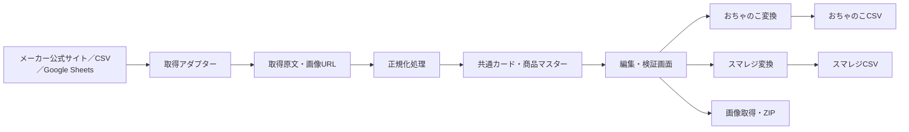
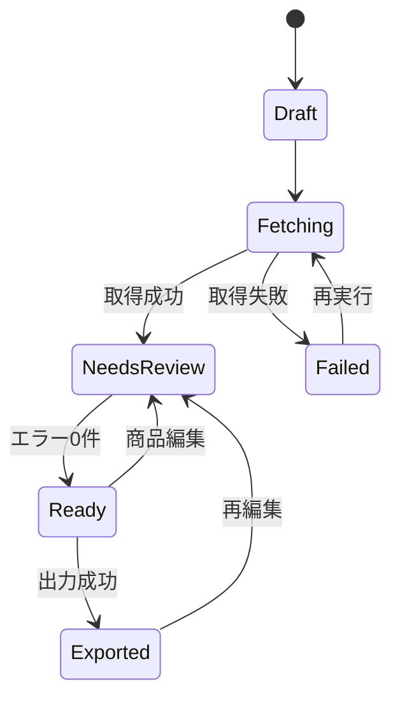

# トレーディングカード商品登録支援システム 基本設計書

## 1. 目的

メーカー公式サイトなどから新商品のカード情報と画像を取得し、内容を画面で確認・編集したうえで、以下を出力する。

- おちゃのこネット商品CSV
- スマレジ商品CSV
- 商品画像一式（ZIP）

同一の商品コードを両CSVへ設定し、既存の在庫管理システムが商品コードで照合できる状態を作る。

## 2. 設計方針

- スクレイピング処理とCSV生成処理を分離する。
- メーカーごとの差異は「取得アダプター」で吸収する。
- 取得結果をそのまま出力せず、共通の商品マスターへ正規化する。
- 自動取得できない販売価格・原価・在庫・部門などは、編集画面と設定マスタで補完する。
- CSV列の並び、文字コード、改行コード、引用符を出力先ごとに固定する。
- 取得元ページの変更を検知し、欠損した商品を誤って出力しない。
- 元データ、編集内容、出力履歴を保存し、再出力できるようにする。

## 3. 対象範囲

### 3.1 MVP（第一段階）

- デジモンカード公式サイト対応
- URLを指定したカード情報取得
- 取得したカードの一覧表示・一括編集・個別編集
- 通常版とパラレル版を別商品として管理
- 画像の一括取得とZIP出力
- おちゃのこネットCSV出力
- スマレジCSV出力
- 入力・出力エラーの検査
- 過去に取り込んだ商品との重複検査

### 3.2 将来対応

- ワンピースカードなど、ほかのメーカー公式サイト
- メーカー提供CSV・Googleスプレッドシート・手動CSVの取込
- おちゃのこネット／スマレジAPI連携（利用可能な場合）
- 在庫管理システムとのAPI連携
- 価格の一括改定、予約商品、傷あり商品、オリパの管理

### 3.3 対象外（MVP）

- おちゃのこネットへの画像アップロード自動操作
- 注文、売上、在庫移動の管理
- 相場からの販売価格自動決定
- ログインや画像認証を回避するスクレイピング

## 4. 利用者と権限

| 権限 | 主な操作 |
|---|---|
| 管理者 | ユーザー、取得元、カテゴリ、部門、採番規則、テンプレート設定 |
| 商品担当者 | 取得、編集、検証、画像ZIP・CSV出力 |
| 閲覧者（将来） | 商品と処理履歴の閲覧 |

MVPでは管理者と商品担当者を同一権限として開始してもよい。

## 5. 業務フロー

1. 「新規取込」を作成する。
2. タイトル、商品セット、取得元URL、発売日を入力する。
3. 取得処理を実行する。
4. 取得データを共通カード形式へ変換する。
5. 既存商品とカード番号・バリエーションで照合する。
6. 商品名、商品コード、カテゴリ、部門、価格、在庫、画像名、説明を自動生成する。
7. 一覧画面で一括編集し、必要に応じて個別編集する。
8. 検証を実行する。エラーが0件になるまで修正する。
9. 画像ZIPを出力し、おちゃのこネットへ一括アップロードする。
10. おちゃのこCSVとスマレジCSVを出力する。
11. 出力バージョンと対象商品を履歴として保存する。

## 6. システム構成



### 推奨技術構成

- Webアプリケーション：Next.js + TypeScript
- DB：PostgreSQL（小規模な試作のみSQLite可）
- バックグラウンド処理：ジョブキュー方式
- スクレイピング：HTTP取得＋HTML解析を基本とし、JavaScript描画が必要なサイトのみブラウザ自動化
- 画像保存：ローカル／オブジェクトストレージ
- 配置：社内PCまたはクラウド。複数人利用する場合はクラウドを推奨

フレームワークは実装時に変更可能だが、「取得」「正規化」「商品編集」「出力」を分離する構造は維持する。

## 7. データモデル

### 7.1 source_sites（取得元サイト）

| 項目 | 内容 |
|---|---|
| id | 内部ID |
| name | デジモン公式など |
| adapter_key | 使用する取得アダプター |
| base_url | 基本URL |
| enabled | 使用可否 |
| request_interval_ms | アクセス間隔 |
| rules_version | 解析ルール版 |

### 7.2 import_batches（取込単位）

| 項目 | 内容 |
|---|---|
| id | 取込ID |
| source_site_id | 取得元 |
| source_url | 取得URL |
| title_id | タイトル |
| set_name / set_code | 商品セット名・コード |
| release_date | 発売日 |
| status | 下書き、取得中、要確認、出力可能、出力済み、失敗 |
| rules_version | 取得時の解析ルール版 |
| fetched_at | 取得日時 |
| created_by | 作成者 |

### 7.3 source_cards（取得原文）

取得元から得た値を加工前に保存する。

- 取得元内ID
- 元HTMLまたは元JSON
- 元画像URL
- 取得値JSON
- 取得日時
- 内容ハッシュ

### 7.4 cards（正規化カード）

| 項目 | 例 |
|---|---|
| card_key | EX12-001_P1 |
| card_number | EX12-001 |
| variation_code | NORMAL / P1 |
| rarity | U |
| card_type | デジタマ |
| level | Lv.2 |
| is_parallel | true / false |
| card_name | ニャロモン |
| colors | 黄 |
| play_cost | 3 |
| dp | 2000 |
| evolution_conditions | 進化条件 |
| form / attribute / traits | 形態・属性・タイプ |
| upper_text / lower_text | 効果テキスト |
| set_name / set_code | 収録商品 |
| source_image_url | 公式画像URL |
| image_file_name | EX12-001_p1.png |

### 7.5 products（販売商品）

カード情報と販売情報を分離する。1枚のカードから「通常」「傷あり」など複数販売商品を作成できる。

| 項目 | 内容 |
|---|---|
| id | 内部商品ID |
| card_id | 元カード |
| product_code | 両システム共通の商品コード |
| product_name | 出力用商品名 |
| condition_code | NM、A-など |
| sale_price / cost_price | 販売価格・原価 |
| initial_stock | 初期在庫 |
| tax_type | 税区分 |
| department_id | スマレジ部門ID |
| category / subcategory / group_name | おちゃのこ分類 |
| description_html | おちゃのこ説明 |
| seo_title / seo_description / seo_keywords | SEO情報 |
| image_file_name | アップロード後に参照する画像名 |
| export_enabled | 出力対象 |
| validation_status | 正常、警告、エラー |

### 7.6 その他

- `titles`：カードタイトル設定
- `category_mappings`：タイトル・セット・レアリティからカテゴリ／部門への変換
- `naming_rules`：商品名、商品コード、画像名、説明HTMLの生成規則
- `export_templates`：出力先別の列順と固定値
- `export_batches` / `export_items`：出力履歴
- `jobs` / `job_logs`：取得・画像処理の進捗とエラー

## 8. 商品コード設計

### 8.1 原則

- おちゃのこ「型番/品番」とスマレジ「商品コード」に同じ値を設定する。
- 一度出力した商品コードは自動変更しない。
- 英数字、ハイフン、アンダースコアを基本とする。
- 通常版、パラレル版、傷ありを必ず区別する。

### 8.2 初期案

`{タイトル略号}_{カード番号}_{バリエーション}_{状態}`

例：

- `DG_EX12-001_N_NM`
- `DG_EX12-001_P1_NM`
- `DG_EX12-001_P1_A-`

既存運用に合わせる必要があるため、実装前に現在の商品コード規則を確定する。規則変更後も既存コードは保持する。

## 9. 商品名・説明生成

### 9.1 商品名テンプレート例

`{カード名} 【{レアリティ}】【{パラレル表記}】【{色}】【{カード番号}】【{セットコード}】`

空の項目は括弧ごと省略する。傷ありの場合は先頭へ状態表記を追加する。

### 9.2 商品説明

既存のおちゃのこ商品説明を以下の部品に分ける。

- ショップ共通注意事項
- カード固有情報
- 状態説明
- 発送・送料説明

テンプレートを管理画面で変更できるようにし、カード固有値だけを差し込む。HTMLは許可タグを限定し、出力前に構文検査する。

## 10. CSV出力設計

### 10.1 おちゃのこネット

- サンプルと完全に同じ204列・同じ列順で出力する。
- 文字コード：CP932（Shift-JIS）
- 改行：CRLF
- 同名ヘッダーが複数存在するため、内部では列名だけでなく列番号で管理する。
- CSV値にカンマ、引用符、改行がある場合はRFC 4180形式でエスケープする。
- 既存テンプレートの固定値は `export_templates` へ保存する。

主なマッピング：

| おちゃのこ列 | 生成元 |
|---|---|
| 商品番号 | 更新時のみ既存値。新規時は運用確認 |
| 商品名 | products.product_name |
| 型番/品番 | products.product_code |
| カテゴリ／サブカテゴリ／グループ | category_mappings |
| 販売価格 | products.sale_price |
| 在庫数 | products.initial_stock |
| メイン写真1 | products.image_file_name |
| 説明 | products.description_html |
| SEO各項目 | 商品テンプレートから生成 |
| その他 | 固定値または空欄 |

### 10.2 スマレジ

サンプルの7列を同じ順で出力する。

| スマレジ列 | 生成元・規則 |
|---|---|
| 商品ID | 新規時は空欄、更新時は既存ID |
| 部門ID | category_mappings.department_id |
| 商品コード | products.product_code |
| 商品名 | products.product_name |
| 原価 | products.cost_price。未入力を許容するか運用設定 |
| 商品単価 | products.sale_price |
| 免税区分 | 通常は0。設定マスタから取得 |

文字コードと新規登録時の商品IDの扱いは、スマレジへのテスト投入で最終確定する。

## 11. 画面設計

### 11.1 ダッシュボード

- 取込中、要確認、出力可能、失敗の件数
- 最近の取込・出力履歴
- 失敗ジョブの再実行

### 11.2 新規取込

- 取得元サイト
- 対象URL
- タイトル、セット名、セットコード、発売日
- 既定カテゴリ、部門ID、初期価格、初期在庫
- 「取得開始」ボタン

### 11.3 商品一覧・一括編集

- 画像サムネイル
- 出力対象、カード番号、バリエーション、商品名、商品コード
- レアリティ、色、価格、原価、在庫、カテゴリ、部門
- エラー・警告
- 検索、絞り込み、並べ替え
- 選択行への価格・在庫・カテゴリ・部門の一括設定
- CSV貼り付けによる価格入力

### 11.4 商品詳細

- 公式取得値と編集値の対比
- 商品名、説明HTML、SEO情報のプレビュー
- 画像プレビュー
- 変更履歴

### 11.5 出力確認

- 対象件数
- エラー／警告件数
- 新規／更新／重複候補件数
- 画像ZIP、おちゃのこCSV、スマレジCSVの生成
- 出力後のファイルハッシュと履歴

### 11.6 設定

- タイトル・部門・カテゴリ対応
- 商品コード規則
- 商品名・説明・SEOテンプレート
- CSV固定値
- 取得元サイトとアクセス間隔

## 12. 検証ルール

### 出力不可エラー

- 商品コードが空、禁止文字を含む、または取込内で重複
- 商品名が空
- 販売価格が空、数値でない、または負数
- 部門IDが未設定
- おちゃのこカテゴリが未設定
- 画像ファイル名が重複
- 必須画像の取得失敗
- CSVの列数がテンプレートと一致しない
- CP932へ変換できない文字を含む

### 警告

- 原価が空
- 初期在庫が0
- 同一カード番号・バリエーションの商品が既に存在
- 公式サイトの件数が前回より大幅に減少
- 公式画像の内容ハッシュが以前と変化
- 商品名や説明が出力先の推奨長を超過

警告は承認して出力できるが、エラーは出力できない。

## 13. スクレイピング設計

各アダプターは次の共通インターフェースを実装する。

```ts
interface CardSourceAdapter {
  validateUrl(url: string): Promise<void>;
  fetchList(url: string): Promise<RawCard[]>;
  normalize(raw: RawCard): NormalizedCard;
  healthCheck(): Promise<AdapterHealth>;
}
```

デジモン対応ではカード番号、パラレル表記、名称、レアリティ、種類、色、コスト、DP、進化条件、形態、属性、タイプ、効果、入手情報、画像URLを取得対象とする。

取得時の安全策：

- 利用規約・robots.txt・画像利用条件を事前確認する。
- 同一ページへのアクセス間隔を設定する。
- タイムアウト、回数制限付き再試行を行う。
- 取得済み内容はキャッシュし、不要な再アクセスを避ける。
- HTML構造変更時はジョブを失敗させ、空データで上書きしない。
- 解析ルール版と元データを保存し、問題を再現できるようにする。

## 14. 画像処理

- 画像URLから原本を取得する。
- HTTPステータス、Content-Type、ファイルサイズを検査する。
- 拡張子を実データと一致させる。
- SHA-256で重複を検出する。
- 商品コードまたは設定した命名規則でファイル名を確定する。
- ZIP内に画像と `manifest.csv` を含める。
- `manifest.csv` には商品コード、カード番号、画像ファイル名、取得元URL、ハッシュを記録する。

## 15. 状態遷移



## 16. 非機能要件

- 1セット300商品程度を通常の利用単位とする。
- 取得・画像処理は画面を閉じても継続する。
- 編集操作は原則2秒以内、進捗は画面へ随時反映する。
- DBは日次バックアップする。
- 出力履歴と編集履歴を最低1年間保持する。
- パスワードはハッシュ化し、通信はHTTPSを利用する。
- 取得元URL以外への任意アクセスを防ぐため、許可ドメインを設定する（SSRF対策）。
- HTML説明はサニタイズし、管理画面でのスクリプト実行を防ぐ。
- CSV数式インジェクション対策として、ユーザー編集値の先頭文字を検査する。

## 17. テスト方針

- 変換単体テスト：カード番号、パラレル、色、特殊文字、空欄
- ゴールデンファイルテスト：サンプルCSVと列数・列順・文字コードを比較
- スクレイピング回帰テスト：保存済みHTMLから同じ結果を再生成
- 結合テスト：URL取得から画像ZIP・2種類のCSVまで
- 異常系：サイト停止、HTML変更、画像404、タイムアウト、文字化け
- 実機確認：少数商品をおちゃのこネットとスマレジへテスト投入

## 18. MVP受入条件

- 指定したデジモンカードURLからカード一覧を取得できる。
- 通常版とパラレル版が別行になる。
- 取得結果を画面で編集し、保存・再開できる。
- 商品コード重複や未入力を検出できる。
- 画像一式をZIPで取得できる。
- おちゃのこCSVが204列、所定の順序、CP932で出力される。
- スマレジCSVが7列、所定の順序で出力される。
- 両CSVの商品コードが一致する。
- サンプル商品を両サービスへ登録できる。
- 同じ取込から同じ内容を再出力できる。

## 19. 実装前に確定する運用項目

1. 商品コードの正式な採番規則
2. おちゃのこ「商品番号」の新規登録時の扱い
3. スマレジ「商品ID」の新規登録時の扱い
4. タイトルごとのスマレジ部門ID
5. おちゃのこカテゴリ・サブカテゴリ・グループの対応
6. レアリティ・パラレルごとの商品名表記
7. 初期価格、原価、在庫の入力方法
8. 商品説明・状態説明・SEO文面の正式テンプレート
9. 画像ファイル名の正式規則
10. 利用者数と、社内PC／クラウドのどちらへ配置するか

## 20. 開発段階案

| 段階 | 内容 |
|---|---|
| 1 | デジモン取得検証、正規化、画像取得 |
| 2 | 商品一覧・一括編集、設定マスタ、検証 |
| 3 | おちゃのこ／スマレジCSV、画像ZIP、履歴 |
| 4 | 実サービスへの少数テスト投入と調整 |
| 5 | 他メーカー用アダプターの追加 |

